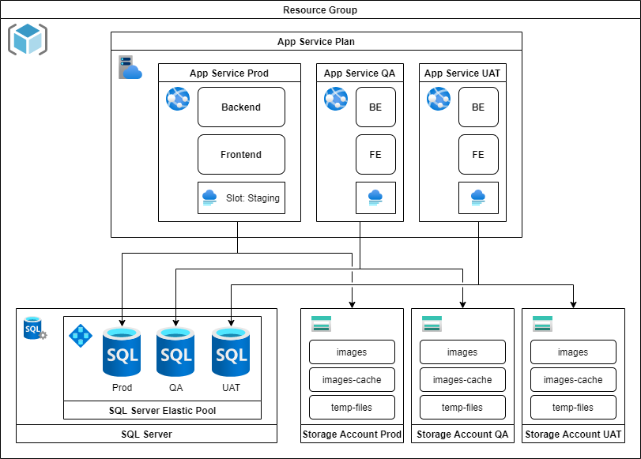

# Mutuali

La plateforme numérique qui facilite le partage d’équipements alimentaires

## Développement local

### **Logiciels**

Logiciels requis:

- Le [SDK .NET](https://dotnet.microsoft.com/download/dotnet) à la version spécifiée dans le fichier `global.json`
- [Volta](https://volta.sh/) (gestionnaire automatique des versions de Node.js)
- [Visual Studio](https://visualstudio.microsoft.com/) ou [Rider](https://www.jetbrains.com/rider/) pour le développement backend
- [SQL Server Express LocalDB](https://docs.microsoft.com/en-us/sql/database-engine/configure-windows/sql-server-express-localdb) – Généralement ce logiciel est installé en même temps que Visual Studio.

Également recommandé:

- [Visual Studio Code](https://code.visualstudio.com/) pour le développement frontend
- [SQL Server Management Studio](https://docs.microsoft.com/en-us/sql/ssms/download-sql-server-management-studio-ssms) pour gérer votre base de données locale.

Notez que le développement sur cette application est uniquement supporté sur Windows, dû à l'utilisation de LocalDB.

### **Installation et configuration**

- Clonez le code source sur votre poste
- Ouvrez un terminal dans le dossier `YellowDuck.FE`
  - Exécutez la commande `npm ci`
  - Confirmez le fonctionnement du build frontend avec `npm run build`
- Configurez le fichier `YellowDuck.Api/appsettings.json`  
  _Note:_ Les informations sensibles (ex: mote de passe ou clé d'API) devrait être des _Users secrets_.

  - `jwt`: Générer et inscrire le `secret`.
  - `Twilio`: Renseigner la section.
    Le `webHookUrl` doit être l'url incluant le nom de domaine vers `/twilio/post-event/`.  
    _Pour plus d'information sur l'utilisation de Twilio dans le projet, voir [Services tiers](#**Services-tiers**)._
  - `hmac`: Générer et inscrire le `secret`.
  - `defaultAdmin`: Renseigner le `password`.
  - `Mailer`: Renseigner la section.
  - `kpisEmailRecipient`: Inscrire l'adresse courriel qui recevra les kpis.
  - `contactEmailRecipient`: Inscrire l'adresse courriel qui recevra les courriels de la section _Nous joindre_.
  - `hangfire`: Inscrire les adresses IP qui seront autorisées à accèder au tableau de bord d'hangfire dans `ipWhitelist`.
  - (facultatif) `Stackify`: Renseigner la section.  
    _Pour plus d'information sur l'utilisation de Stackify dans le projet, voir [Services tiers](#**Services-tiers**)._
  - (facultatif) `Stripe`: Renseigner la section.  
    _Pour plus d'information sur l'utilisation de Stripe dans le projet, voir [Services tiers](#**Services-tiers**)._

  _Astuce:_ Vous pouvez utiliser la commande suivante pour générer un secret aléatoire:

  ```bash
  node -e "console.log(require('crypto').randomBytes(32).toString('hex'));"
  ```

- Configurez le fichier `YellowDuck.Api/appsettings.Development.json`
  - `ConnectionStrings`: Inscrire les connections strings à utiliser pour le `AppDbContext` et `Hangfire`.
- Ouvrez un terminal dans le dossier `YellowDuck.Api`
  - Exécutez la commande `dotnet restore`
  - Confirmez le fonctionnement du build backend avec `dotnet build`
  - Confirmez que les tests passent à partir du terminal, dans le dossier `YellowDuck.ApiTests` avec la commande `dotnet test`

### **Développement**

Pour travailler, il faut exécuter séparément les projets backend et frontend.

#### **Backend**

Si vous avez l'intention de travailler sur le code backend, vous pouvez exécuter le projet avec les fonctionnalités de votre IDE (en mode debug ou non).

Pour travailler uniquement sur le frontend, on peut exécuter le backend en ligne de commande:

- `cd YellowDuck.Api`
- `dotnet run`

#### **Frontend**

En ligne de commande:

- `cd YellowDuck.FE`
- `npm run serve`

##### **Frameworks utilisés**

- [Vue.js 2.6.x](https://v2.vuejs.org/)
- [Bootstrap 4.5.x](https://getbootstrap.com/docs/4.5/)
- [BootstrapVue 2.21.2](https://bootstrap-vue.org/docs)

#### **Accéder à l'app**

Une fois que le backend et le frontend s'exécutent, vous pouvez accéder à l'application à l'adresse: [http://localhost:62543](http://localhost:62543/).

Vous pouvez utiliser un des comptes tests par défaut pour vous connecter.

##### **Comptes utilisateurs:**

- `ubert@example.com`  
  _Mot de passe:_ `Abcd1234!!`
- `uguette@example.com`  
  _Mot de passe:_ `Abcd1234!!`

##### **Comptes administrateur:**

- `alain@example.com`  
  _Mot de passe:_ `Abcd1234!!`
- `aline@example.com`  
  _Mot de passe:_ `Abcd1234!!`

_Note:_ Ces comptes sont seulement créés sur les environements de développement. En production, un compte administrateur est automatiquement créé basé sur les valeurs inscritent dans le fichier `YellowDuck.Api/appsettings.json`.

## **Hébergement**

En production, l'application est conçue pour être hébergées sur _Azure App Services_.

Un script de création des ressources _Azure_ est à votre disposition dans le dossier `/arm`. Consultez les instructions spécifiques à ce script [/arm/readme.md](arm/readme.md) pour en apprendre davantage.

Si vous utilisez ce script, l'infrastructure devrait être la suivante:



**Note**: Bien que l'environnement _Azure_ soit fortement recommandé, l'application est conçu pour pouvoir être adapté à d'autres types d'hébergement. Au moment d'écrire ces lignes, la seule dépendance directe aux services Azure est le système de stockage de fichiers (`YellowDuck.Api/Services/Files/AzureStorageFileManager.cs`), et celui-ci peut être remplacé par une implémentation alternative si nécessaire. C'est d'ailleurs déjà le cas lors du développement, où les fichiers sont stockés sur le poste du développeur.

## **_Builds_ et déploiements**

L'intégration et les déploiements en continue (_CI/CD_) sont supportés via _Azure DevOps_.

Le fichier `azure-pipelines.yml` contrôle la procédure de _build_ du projet. Le processus compile d'abord le projet frontend, puis le backend. Les fichiers générés pour le frontend sont téléchargés dans le projet backend pour que celui-ci puisse les héberger une fois le projet déployé. Pour l'utiliser dans un nouveau projet, allez dans la section _Pipelines_ d'_Azure DevOps_ et créez un nouveau _pipeline_ en indiquant que votre code se trouve dans _Azure Repos Git_. En sélectionnant votre _repository_, le fichier YAML devrait automatiquement être détecté. Cliquez sur _Run_ pour sauvegarder.

Le dossier `/azure-devops` contient un template qui peut être importé dans un projet _Azure DevOps_ pour configurer un déploiement. Vous devez configurer un déploiement pour chaque environnement. Vous êtes libres de configurer les automatisations et les approbations en fonction des besoins concrets de votre projet. Consultez le fichier [/azure-devops/readme.md](azure-devops/readme.md) pour plus d'informations.

## **Services tiers**

### **Twilio**

[Twilio Conversations](https://www.twilio.com/docs/conversations) est utilisé pour les discussions entres les utilisateurs à propos d'une annonce.

Il est donc nécessaire de se créer un compte Twilio et de [créer une clé d'API](https://www.twilio.com/docs/glossary/what-is-an-api-key).

### **Stackify**

_Facultatif_

[Stackify](https://stackify.com/) est utilisé pour la journalisation de l'application.

Afin de l'utiliser, un compte doit être créer et l'`activation key` doit être récupéré dans `Settings > Configure App`

### **Stripe**

_Facultatif / En développement_

Stripe est utilisé pour la gestion des paiements dans l'application.

Les contrats de location et les paiements de ceux-ci étant en développement, son utilisation est facultative.
